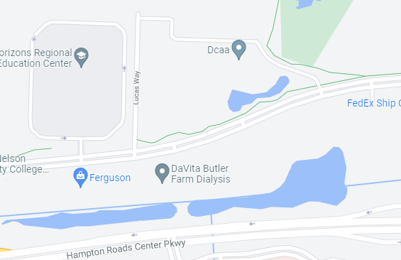

## Animals on Road Detection
This would be a system which detects and indetifies animals on the blind turn at the beginning of Butler Farm Road. If it detects animals on the road, a sign 100ft before the turn will start blinking.

### Parts
 - Light Camera
 - Infarared Camera
 - Solar Power system

## Advanced Radio
Radio that detects if a song matches a set of unwanted songs and changes the station if that is the case.

### Parts
 - AUX input
 - Radio that is willing to be modified heavily (for simulated buttons)

