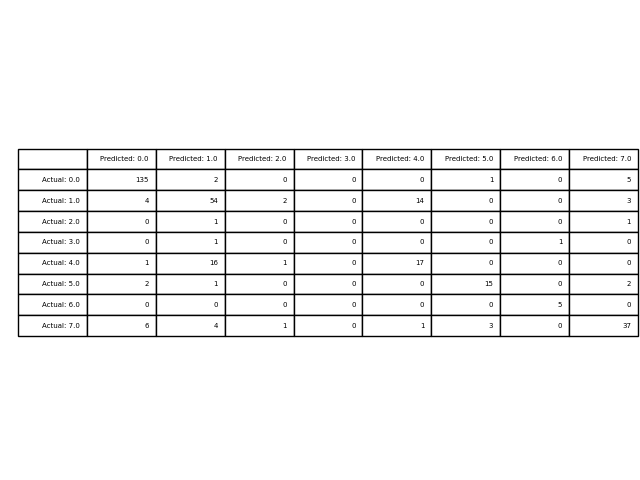

## General Metrics: 
- Accuracy was: 0.7827380952380952
- Execution time: 1.5631003379821777 seconds
- Consumed Memory: 90112
## Metrics for 0:
| Metric | Result |
| --- | --- | 
| Precision |0.912 |
| Recall |0.944 |
| F1-Score |0.928 |
| Sensitivity |0.944 |
| Specificity |0.933 |

## Metrics for 1:
| Metric | Result |
| --- | --- | 
| Precision |0.684 |
| Recall |0.701 |
| F1-Score |0.692 |
| Sensitivity |0.701 |
| Specificity |0.903 |

## Metrics for 2:
| Metric | Result |
| --- | --- | 
| Precision |0.000 |
| Recall |0.000 |
| F1-Score |N/A |
| Sensitivity |0.000 |
| Specificity |0.988 |

## Metrics for 3:
| Metric | Result |
| --- | --- | 
| Precision |N/A |
| Recall |0.000 |
| F1-Score |N/A |
| Sensitivity |0.000 |
| Specificity |1.000 |

## Metrics for 4:
| Metric | Result |
| --- | --- | 
| Precision |0.531 |
| Recall |0.486 |
| F1-Score |0.508 |
| Sensitivity |0.486 |
| Specificity |0.950 |

## Metrics for 5:
| Metric | Result |
| --- | --- | 
| Precision |0.789 |
| Recall |0.750 |
| F1-Score |0.769 |
| Sensitivity |0.750 |
| Specificity |0.987 |

## Metrics for 6:
| Metric | Result |
| --- | --- | 
| Precision |0.833 |
| Recall |1.000 |
| F1-Score |0.909 |
| Sensitivity |1.000 |
| Specificity |0.997 |

## Metrics for 7:
| Metric | Result |
| --- | --- | 
| Precision |0.771 |
| Recall |0.712 |
| F1-Score |0.740 |
| Sensitivity |0.712 |
| Specificity |0.961 |

